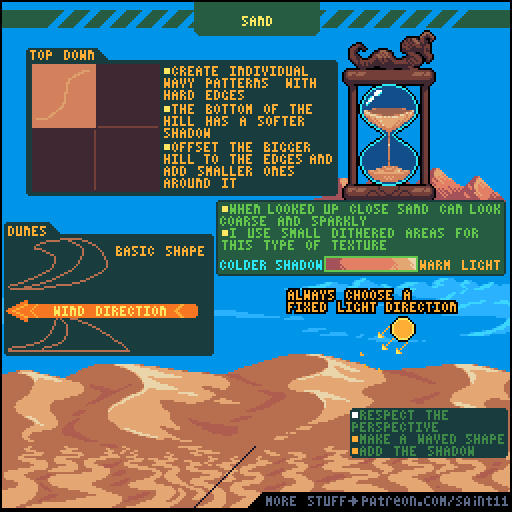
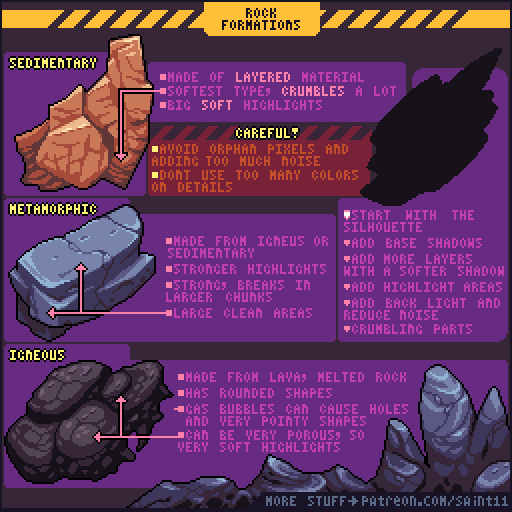

# 场景

## Top Down Tricks

## Top Down Houses

## Ice and Snow Tutorial

## Modern / Indoors

## Sand

## Darkness

## Space/stars

## Clouds

## Environmental Hazards

## Making Tiles

## City backgrounds

## Vegetation part 3

## Vegetation Tutorial Part 2

## Vegetation Tutorial Part 1

## Rock Formations

## Fluids/Slime

## Ruins Tutorial

## Level design progression

Level design is not really my specialty, and it's a very personal subject, so these are just some thoughts I usually have when designing levels, not rules. The core of fun for me is the Learning. This is why every time I add something to my level I ask myself "What am I teaching here?" and "What am I asking the player?".

Another important thing is the Pacing. I always try to have some safer areas or strong powerups after difficult parts, so the player can catch their breath and try new stuff. This is that dip in the curve, and that's specially useful to make the next part feel even harder without actually making it hard and frustrating the player.

