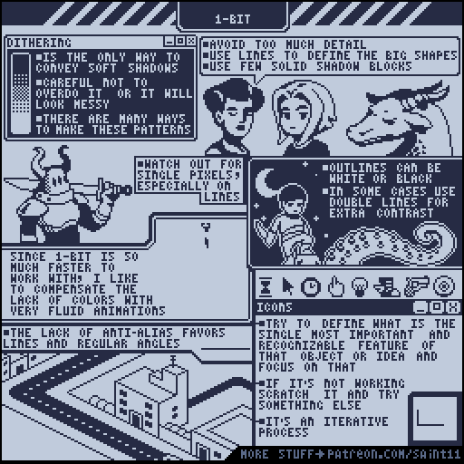
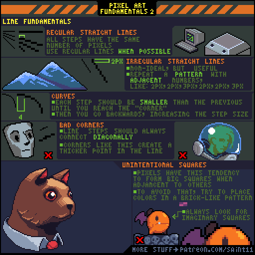

# 基础

##  Isometric part 1

## Illumination Techniques

## UI: The 9-Slice

## 1-Bit

## Outlines

## Shading

## Parallax and Depth

## &lt;1 Pixel Movement Tutorial

## Pixel Art Fundamentals Part 2

## Pixel Art Fundamentals Part 1

