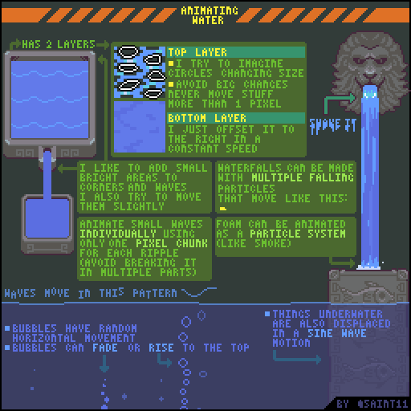

# 特效

## Impact!

## Breaking Objects

## Wind/Tornado

## Blood and Guts

## Motion Blur

## Light Magic Effects

## Dark Magic Effects

## Spaceship Propulsion Tutorial

## Explosions, part 1

## Fire Tutorial

## Water Tutorial

This is probably the most complex tutorial I've made so far, but I hope it can be useful! Water is definitely not my specialty, so I had to do a lot of research for this one. As always, a disclaimer, those are not stone written rules, they are just how I usually think when drawing water. And this is not how real water behaves, just how I think it looks cool.

Drawing water for me is all about the flow, I always try to pay attention to the loop and to make everything move around all the time.

## Glitch Effect Tutorial

I always try to get references from real glitches I see around. Like bad monitors at the shopping mall, weird glitches in those animated signs on shops or when my video card decides to get crazy.

I usually try to pay attention to what the glitches are actually doing, are they moving everything to the left? Is the green color off? Is everything just a bunch of random colored noise? I try to get those real-life examples of glitches and make them look pretty and cool. For me, the idea is to make something that's not too real and not too fake.

## Electricity

Electricity bolts are very fast, so in the first frame it should be at its maximum size and then it can dissipate slowly.

I usually make electricity starting with sharp angles and then it gets softer while it dissipates. Even though in the real world electricity almost never looks this sharp I found out that it looks better when animating if it does.

## Simple Shine

As you can see the important thing is the timing, the frame 3 is used to skip most of the area you want to shine.

You can use a simple shine like that, or add a second shine \(the extra shine\) after a single empty frame, or even use just the extra shine, for some effects.

## Smoke

Every time I have to animate complex systems like smoke, splashing water, or fire, I try to break the system down to small parts and then I animate those parts individually.

Thinking of how a whole puff of smoke will move is just too complex for me, but thinking on how a small part of will move is relatively simple.

If you notice the last example, it's a loop smoke effect, the only difference from the others is that I try to spawn more smoke every 4 frames or so, and continue the particles "story" on frame 1, after the last frame. I' ll explain more about looping animations on another tutorial.

