# 动作

## Jumping

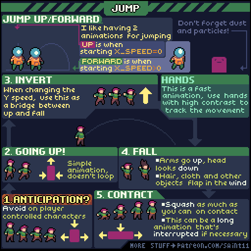

## Top Down Attack

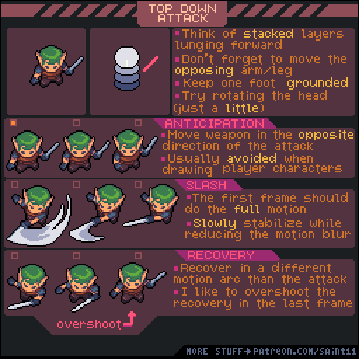

## Top Down Walk Cycle

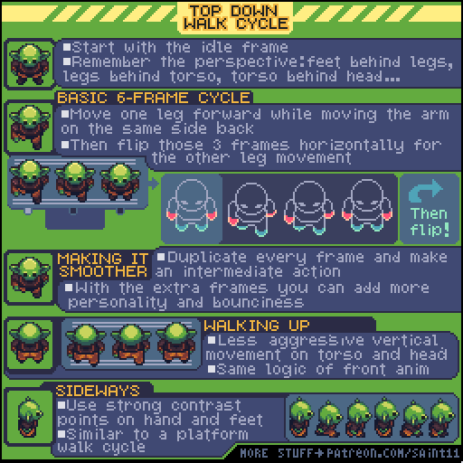

## Defend/Take Hit

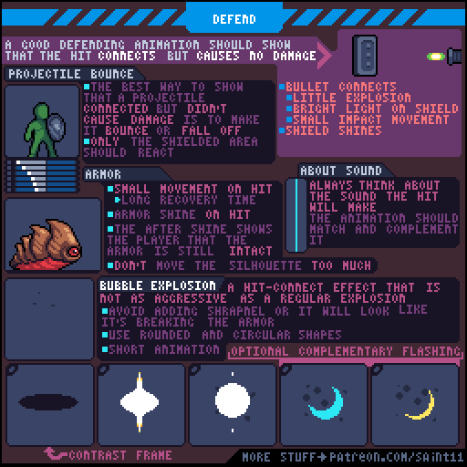

## Slide/Roll/Dash

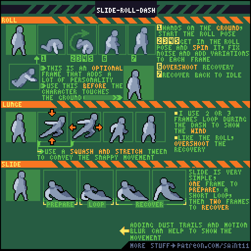

## Wall Slide / Wall Kick

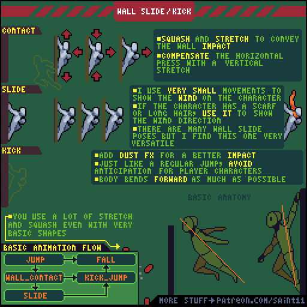

## Modular Animation

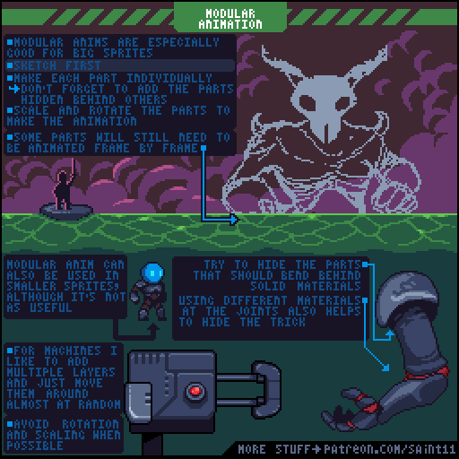

## Simple Walk Cycle

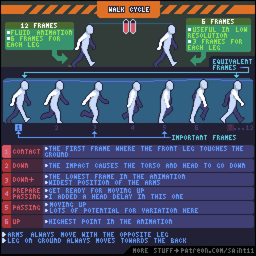

## Quadruped walk/trot cycle

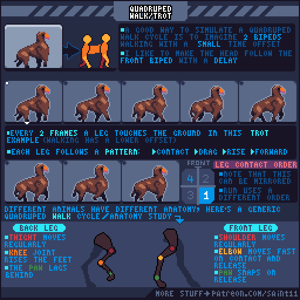

## Character Idle

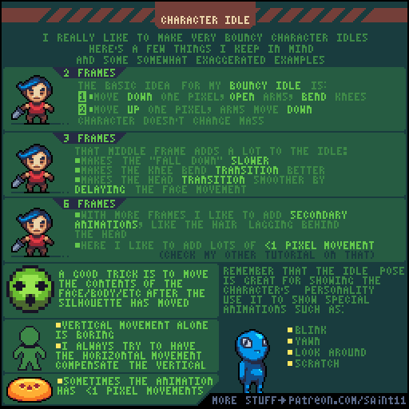

## Squash and Stretch

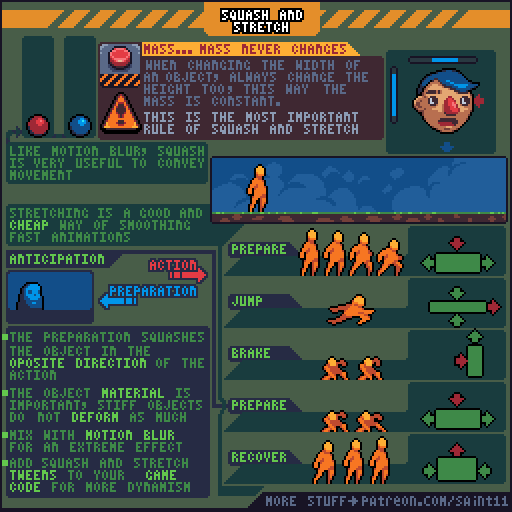

## Pixel Art Process

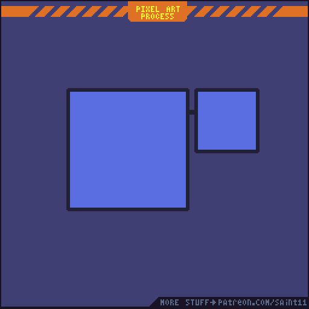

## Animation Easing

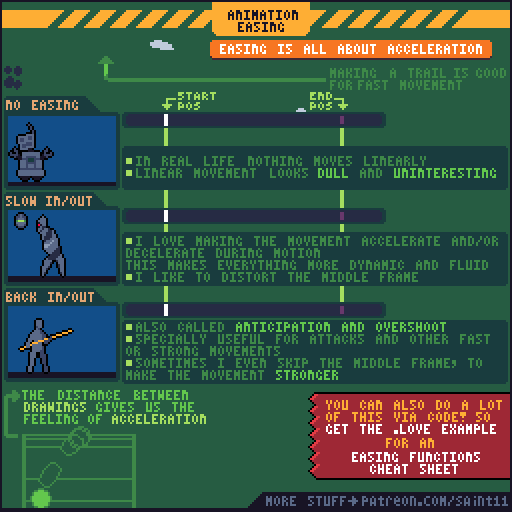

## Animation Planning

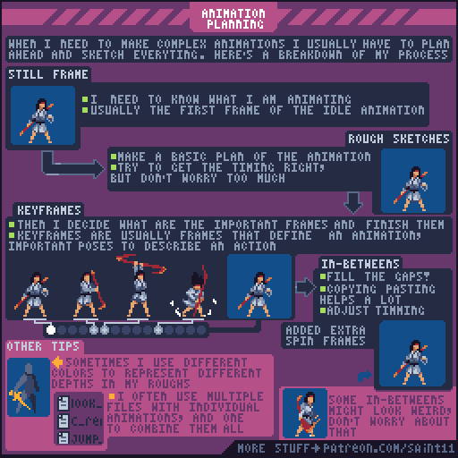

## Seamless Animation Tutorial

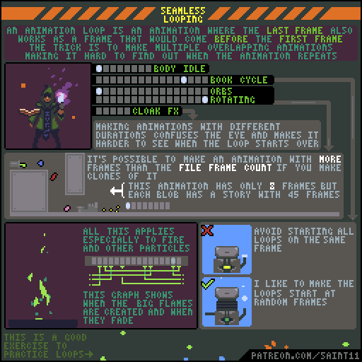

## Simple Attack

With an attack animation one of the most important things to do is  to make sure that the player feels the input immediately. So, the hitbox area must be filled IMMEDIATELY in the first frame, no anticipation, nothing.

Since that action is so fast you must make it bonuce back until the relaxed position again, and then I usually add another little bounce \(frame 8\) just to make everything juicier.

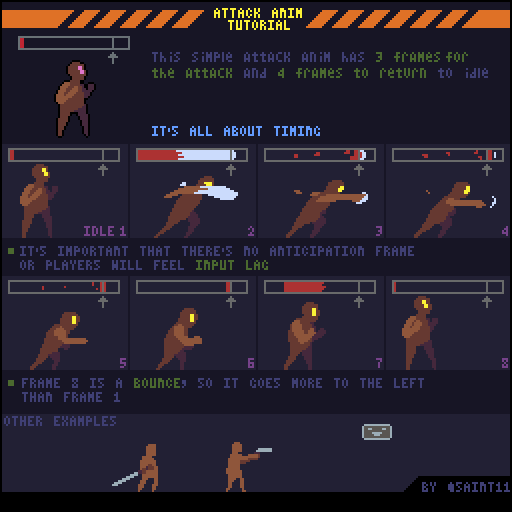

## Simple Run

My biggest advice for people learning how to make walk/run animations is pay attention to the head movement. Even if the legs and arms movements are not that great, the animation will still convince people if the head movement is good.

Now, let me explain why I chose this particular run cycle. I think a lot of people won't like my "jump" frame and will prefer to use the "pas pos." frame, that looks kinda like this:

That's totally fine, this is just the simplest and easiest way I could think of making a run that effectively would work in a platformer. Walk/run animations shows a lot of the personality of the character, so there are infinite variations on how that animation can be done.

The reason that I opted for that "jump" frame is that it's so easy to duplicate it and just drop one or two pixels, move the arms and legs a little to make the "fall down" frame. So, I usually find that method effective for fast run animations.

Another reason is if the first frame is a jump it looks like the character jumped into movement, making the animation more dynamic.

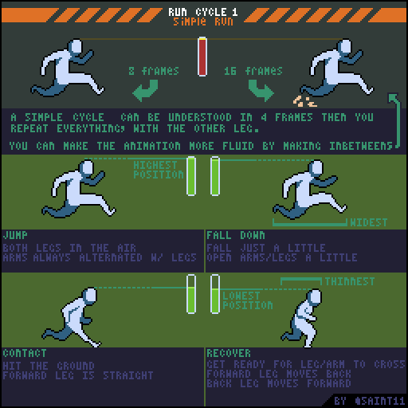

## Top Down Run Cycle

I usually focus on the 3 jump frames and 2 recover frames thing and then I try to connect everything by making secondary animations, like hair movement, clothes, etc.

If you need to, it's also possible to just make one jump and one recover for a super minimal animation, but it won't look very fluid.

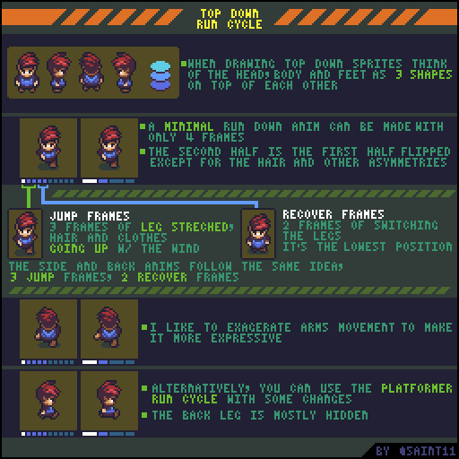

